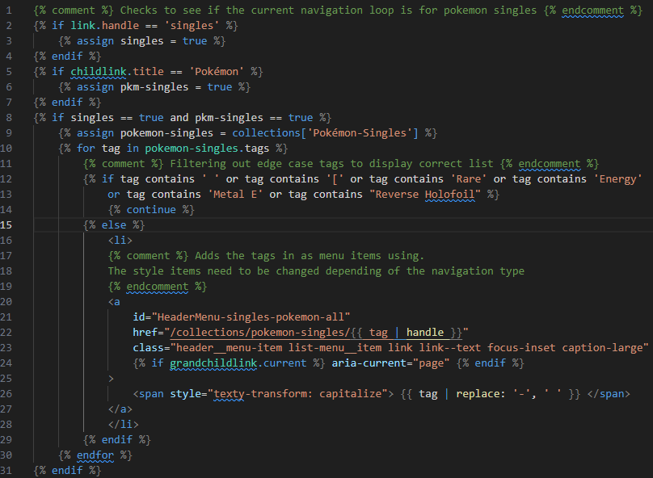

# Read Me
The following is a breakdown of the way in which I helped a local TCG Business called Luna Cards improve the UI/UX of their website. The final algorithm that produces the required functionality can be found in [code.liquid](./code.liquid).

## Business Requirements 
To help Luna Cards customers navigate through the large Pokemon-Singles collection listed on the shopify a list of the set of Pokemon cards in-stock was required in the top navigation bar. So that customers could see in the navigation menu a list of the Pokemon card sets currently in stock. Any solution should be able to be easily applied to other TCG Collections in the future.

#### Roadblocks
- The store uses over 250 tags which means Shopify's own Search & Discovery tool 
couldn't work.
- No 3rd Party app in the Shopify App store had a drop in solution that fit the business requirements.
- Some 3rd party apps are able to get around this 250 tag limit.
- Filtering out the garbage tags from the collection to end up with the list of card sets.
- Two different styles types of navigation in use, Mobile & PC, and would need to work on both.

## Solution
Since there was no feasible drop in solution modifications to show the navigation bars menu system was required. The tag system would need be required as they could be injected into html to filter the collection.

#### Steps Required
1. Access the Required collection of Pokemon Single items in-stock
2. Loop over the collection
3. Filter out the non required tags
4. Display the Pokemon Sets currently in-stock and integrate into the existing top nav UI.

#### Final Algorithm

This code is places inside the liquid theme template in the header-dropdown-menu.liquid and header-drawer-menu.liquid files in the loop which creates the third menu item.
- Lines 2-7 check as if the collection being loaded into the navigation during this cycle of the loop is a "singles" type and the name contains "Pokemon". More variables could be added to gain extra functionality for different TCG types.
- Lines 8-31 are the algorithm where it loops through all of the tags that the relevant collection contains. It then filters out any unusable tags and displays the Set Types of the cards within the collection as a navigation list item.

## Result

- The final algorithm was able to help create a dynamic list of card set types for Pokemon Singles and was able to be tweaked if needed to apply to other TCG types. 
- Through the use of the built in CSS styling the original UI/UX look of the website is unchanged.
- This code has then been tweaked to apply to some of the Sealed types of TCG stock Luna Cards sell.

##### Caveats
- The code must be modified for each individual TCG Type and tweaked to operate properly for each type as well as top navigation type.

